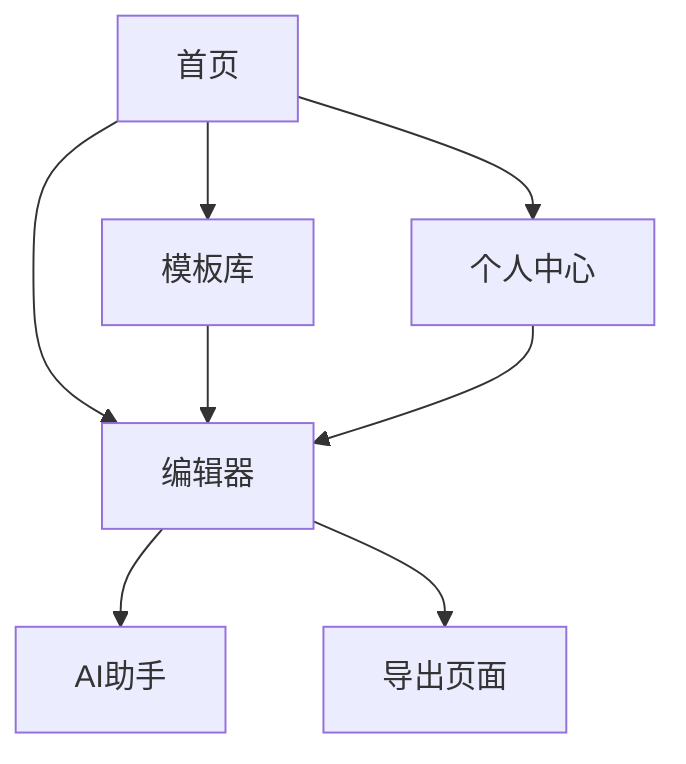

## 1. 产品概述
ISV智能产品页设计工具是一款专为独立软件开发商设计的可视化页面构建工具，帮助ISV快速创建美观专业的产品介绍页面。ISV开发完产品后，需要在平台上架时提供详细的产品介绍页，但普遍存在表达不够、设计能力弱的问题。本工具通过AI辅助和模板化设计，大幅提升页面质量底线，支持一键复制到平台的标准富文本编辑器中。

目标用户为技术背景但设计能力有限的ISV开发者，帮助他们快速生成专业级产品介绍页面，提高产品上架效率和展示效果。

## 2. 核心功能

### 2.1 用户角色
| 角色 | 注册方式 | 核心权限 |
|------|----------|----------|
| ISV开发者 | 邮箱注册 | 使用模板、编辑页面、AI辅助、导出页面 |
| 平台管理员 | 后台创建 | 管理模板库、查看使用统计、内容审核 |

### 2.2 功能模块
本产品包含以下核心页面：
1. **首页**：模板展示、快速开始、使用引导
2. **编辑器页面**：可视化编辑、区块管理、样式设置
3. **AI助手页面**：文案优化、图片生成、内容建议
4. **模板库页面**：模板浏览、分类筛选、模板预览
5. **个人中心**：我的作品、使用记录、账户设置

### 2.3 页面详情
| 页面名称 | 模块名称 | 功能描述 |
|----------|----------|----------|
| 首页 | 模板展示区 | 展示热门模板，支持分类筛选和搜索 |
| 首页 | 快速开始 | 提供创建新页面的快捷入口 |
| 首页 | 使用引导 | 新手教程和操作指引 |
| 编辑器页面 | 画布区域 | 拖拽式编辑，所见即所得 |
| 编辑器页面 | 组件库 | 提供文本、图片、按钮等基础组件 |
| 编辑器页面 | 样式面板 | 调整颜色、字体、间距等样式属性 |
| 编辑器页面 | 图层管理 | 管理页面元素层级关系 |
| AI助手页面 | 文案优化 | 输入原始文案，AI生成专业版本 |
| AI助手页面 | 图片生成 | 根据描述生成配图或图标 |
| AI助手页面 | 内容建议 | 基于产品类型推荐内容结构 |
| 模板库页面 | 模板分类 | 按行业、风格、用途分类展示 |
| 模板库页面 | 模板预览 | 全屏预览模板效果 |
| 模板库页面 | 模板收藏 | 收藏常用模板便于复用 |
| 个人中心 | 我的作品 | 管理创建的历史作品 |
| 个人中心 | 导出记录 | 查看导出历史和使用统计 |
| 个人中心 | 账户设置 | 修改个人信息和偏好设置 |

## 3. 核心流程

### ISV开发者使用流程
1. 注册登录后进入首页，浏览模板库选择合适的模板
2. 进入编辑器页面，基于模板进行个性化修改
3. 使用AI助手优化文案内容，生成所需图片素材
4. 调整页面样式和布局，实时预览效果
5. 完成后导出为富文本格式，一键复制到平台编辑器

### 页面导航流程

## 4. 用户界面设计

### 4.1 设计风格
- **主色调**：科技蓝 (#1890ff) 搭配中性灰 (#f5f5f5)
- **按钮样式**：圆角矩形，主按钮使用渐变色
- **字体选择**：中文使用思源黑体，英文使用Inter，正文字号14-16px
- **布局风格**：卡片式布局，左侧工具栏+中央画布+右侧属性面板
- **图标风格**：线性图标，简洁现代，符合B端产品调性

### 4.2 页面设计概览
| 页面名称 | 模块名称 | UI元素 |
|----------|----------|--------|
| 首页 | 模板展示区 | 网格布局展示模板卡片，包含预览图、标题、使用次数，悬停显示操作按钮 |
| 编辑器页面 | 画布区域 | 白色背景画布，拖拽网格辅助线，选中元素显示边框和调整手柄 |
| 编辑器页面 | 左侧工具栏 | 垂直排列的图标按钮，包含组件、模板、图层三个标签页 |
| 编辑器页面 | 右侧面板 | 折叠式属性面板，按元素类型显示对应设置选项 |
| AI助手页面 | 对话框 | 类似ChatGPT的对话界面，支持多轮对话和历史记录 |

### 4.3 响应式设计
采用桌面端优先设计，确保在1920×1080分辨率下最佳体验。编辑器区域支持响应式适配，在较小屏幕上自动调整面板宽度和隐藏次要功能。

### 4.4 交互优化
- 拖拽操作添加视觉反馈，元素放置时有吸附效果
- 所有操作支持撤销重做，提供历史版本管理
- 导出过程显示进度条，完成后提供预览和复制按钮
- AI生成内容支持一键替换或部分采纳