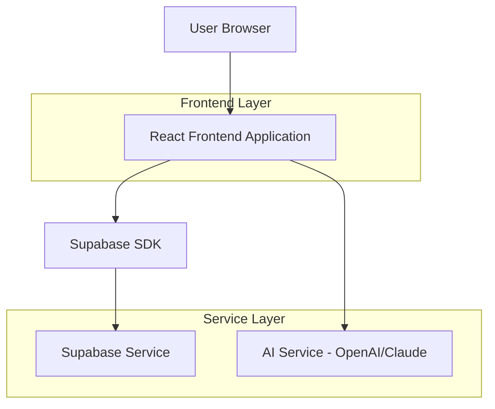
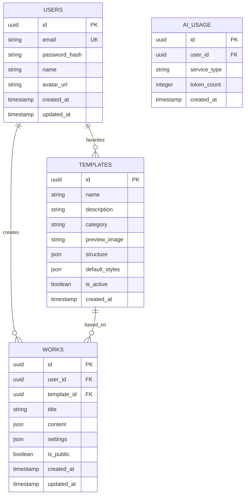
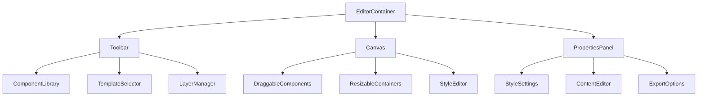

## 1. 架构设计



## 2. 技术描述
- **前端**: React@18 + TypeScript + TailwindCSS@3 + Vite
- **初始化工具**: vite-init
- **状态管理**: Zustand
- **UI组件库**: Ant Design@5
- **拖拽库**: react-dnd
- **富文本编辑器**: Quill.js (用于最终导出)
- **后端**: Supabase (认证、数据库、存储)
- **AI服务**: OpenAI API (文案优化)、DALL-E (图片生成)

## 3. 路由定义

| 路由 | 用途 |
|------|------|
| / | 首页，展示模板库和快速入口 |
| /editor/:id? | 编辑器页面，新建或编辑作品 |
| /templates | 模板库页面，浏览和选择模板 |
| /ai-assistant | AI助手页面，文案优化和图片生成 |
| /profile | 个人中心，管理作品和账户 |
| /login | 登录页面 |
| /register | 注册页面 |

## 4. API定义

### 4.1 用户认证相关
```
POST /api/auth/register
```

请求参数：
| 参数名 | 参数类型 | 是否必需 | 描述 |
|--------|----------|----------|------|
| email | string | true | 用户邮箱 |
| password | string | true | 密码 |
| name | string | true | 用户姓名 |

响应：
| 参数名 | 参数类型 | 描述 |
|--------|----------|------|
| user | object | 用户信息 |
| token | string | 访问令牌 |

### 4.2 作品管理相关
```
GET /api/works
```
获取用户作品列表

```
POST /api/works
```
创建新作品

请求参数：
| 参数名 | 参数类型 | 是否必需 | 描述 |
|--------|----------|----------|------|
| title | string | true | 作品标题 |
| template_id | string | false | 模板ID |
| content | object | true | 页面内容结构 |

### 4.3 AI服务相关
```
POST /api/ai/optimize-text
```
优化文案内容

请求参数：
| 参数名 | 参数类型 | 是否必需 | 描述 |
|--------|----------|----------|------|
| text | string | true | 原始文案 |
| context | string | false | 上下文信息 |

```
POST /api/ai/generate-image
```
生成图片

请求参数：
| 参数名 | 参数类型 | 是否必需 | 描述 |
|--------|----------|----------|------|
| prompt | string | true | 图片描述 |
| size | string | false | 图片尺寸 |

## 5. 数据模型

### 5.1 数据模型定义


### 5.2 数据定义语言

用户表 (users)
```sql
-- 创建表
CREATE TABLE users (
  id UUID PRIMARY KEY DEFAULT gen_random_uuid(),
  email VARCHAR(255) UNIQUE NOT NULL,
  password_hash VARCHAR(255) NOT NULL,
  name VARCHAR(100) NOT NULL,
  avatar_url TEXT,
  created_at TIMESTAMP WITH TIME ZONE DEFAULT NOW(),
  updated_at TIMESTAMP WITH TIME ZONE DEFAULT NOW()
);

-- 创建索引
CREATE INDEX idx_users_email ON users(email);
```

作品表 (works)
```sql
-- 创建表
CREATE TABLE works (
  id UUID PRIMARY KEY DEFAULT gen_random_uuid(),
  user_id UUID NOT NULL REFERENCES users(id) ON DELETE CASCADE,
  template_id UUID REFERENCES templates(id),
  title VARCHAR(255) NOT NULL,
  content JSONB NOT NULL,
  settings JSONB DEFAULT '{}',
  is_public BOOLEAN DEFAULT false,
  created_at TIMESTAMP WITH TIME ZONE DEFAULT NOW(),
  updated_at TIMESTAMP WITH TIME ZONE DEFAULT NOW()
);

-- 创建索引
CREATE INDEX idx_works_user_id ON works(user_id);
CREATE INDEX idx_works_created_at ON works(created_at DESC);
```

模板表 (templates)
```sql
-- 创建表
CREATE TABLE templates (
  id UUID PRIMARY KEY DEFAULT gen_random_uuid(),
  name VARCHAR(255) NOT NULL,
  description TEXT,
  category VARCHAR(50) NOT NULL,
  preview_image TEXT,
  structure JSONB NOT NULL,
  default_styles JSONB DEFAULT '{}',
  is_active BOOLEAN DEFAULT true,
  created_at TIMESTAMP WITH TIME ZONE DEFAULT NOW()
);

-- 创建索引
CREATE INDEX idx_templates_category ON templates(category);
CREATE INDEX idx_templates_active ON templates(is_active);
```

AI使用记录表 (ai_usage)
```sql
-- 创建表
CREATE TABLE ai_usage (
  id UUID PRIMARY KEY DEFAULT gen_random_uuid(),
  user_id UUID NOT NULL REFERENCES users(id) ON DELETE CASCADE,
  service_type VARCHAR(50) NOT NULL,
  token_count INTEGER DEFAULT 0,
  created_at TIMESTAMP WITH TIME ZONE DEFAULT NOW()
);

-- 创建索引
CREATE INDEX idx_ai_usage_user_id ON ai_usage(user_id);
CREATE INDEX idx_ai_usage_created_at ON ai_usage(created_at DESC);
```

### 5.3 Supabase权限设置
```sql
-- 匿名用户权限
GRANT SELECT ON templates TO anon;

-- 认证用户权限
GRANT ALL PRIVILEGES ON works TO authenticated;
GRANT ALL PRIVILEGES ON ai_usage TO authenticated;
GRANT SELECT ON templates TO authenticated;

-- RLS策略
ALTER TABLE works ENABLE ROW LEVEL SECURITY;
ALTER TABLE ai_usage ENABLE ROW LEVEL SECURITY;

-- 用户只能查看和编辑自己的作品
CREATE POLICY "Users can view own works" ON works FOR SELECT
  USING (auth.uid() = user_id);

CREATE POLICY "Users can create own works" ON works FOR INSERT
  WITH CHECK (auth.uid() = user_id);

CREATE POLICY "Users can update own works" ON works FOR UPDATE
  USING (auth.uid() = user_id);

CREATE POLICY "Users can delete own works" ON works FOR DELETE
  USING (auth.uid() = user_id);
```

## 6. 核心组件架构

### 6.1 编辑器组件结构


### 6.2 导出功能实现
导出流程采用以下技术方案：
1. 将页面结构转换为HTML字符串
2. 内联所有CSS样式（避免外部依赖）
3. 压缩图片并转为Base64格式
4. 生成符合富文本编辑器要求的HTML代码
5. 提供一键复制到剪贴板功能

### 6.3 AI集成方案
- **文案优化**: 使用OpenAI GPT-4模型，提供产品描述上下文
- **图片生成**: 使用DALL-E 3，生成商业风格的配图
- **内容建议**: 基于模板类型和用户输入，推荐合适的文案结构
- **使用限制**: 免费用户每日10次，付费用户每日100次调用