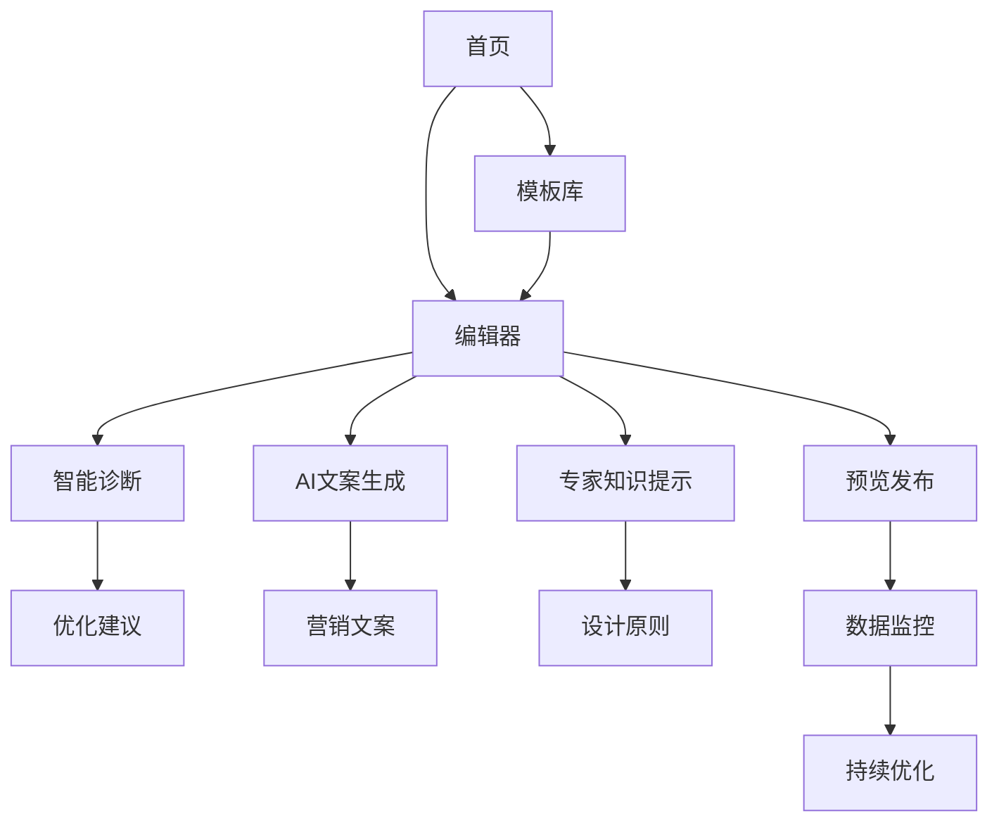

## 1. 产品概述
ISV智能产品页设计工具是一款专为电商卖家打造的智能化产品详情页设计平台。通过集成高转化率设计原则和AI技术，帮助商家快速创建具有营销力的商品详情页，提升转化率和销售业绩。

产品解决的核心问题：传统产品页设计缺乏营销思维，转化率低；商家缺乏专业设计经验和转化率优化知识。目标用户为电商卖家、品牌营销人员，通过智能化工具降低高质量营销页面制作门槛。

## 2. 核心功能

### 2.1 用户角色
| 角色 | 注册方式 | 核心权限 |
|------|----------|----------|
| 普通用户 | 邮箱注册 | 基础模板使用、AI文案生成、基础诊断 |
| 高级用户 | 付费升级 | 高级模板、深度诊断、专家知识库、AI营销专家 |
| 企业用户 | 企业认证 | 团队协作、品牌定制、API接入、专属客服 |

### 2.2 功能模块
产品包含以下核心页面：
1. **首页**: 产品展示、模板推荐、转化率案例展示、用户引导
2. **编辑器页面**: 可视化拖拽、智能诊断、专家知识提示、AI文案生成
3. **模板库页面**: 高转化率模板分类、行业筛选、收藏管理
4. **知识库页面**: 转化率设计原则、营销心理学、案例解析
5. **用户中心**: 项目管理、数据统计、团队协作、账户设置

### 2.3 页面详情
| 页面名称 | 模块名称 | 功能描述 |
|----------|----------|----------|
| 首页 | Hero区域 | 展示产品核心价值主张，突出"高转化率"卖点，包含动态数据展示 |
| 首页 | 模板推荐 | 基于行业热度排序，展示高转化率模板，支持预览和快速使用 |
| 首页 | 案例展示 | 真实商家使用前后转化率对比，增强产品可信度 |
| 编辑器 | 画布区域 | 支持拖拽组件、实时预览、响应式布局、历史版本管理 |
| 编辑器 | 智能诊断 | 基于转化率原则实时分析页面，识别问题并给出优化建议 |
| 编辑器 | 组件库 | 提供高转化率组件：主图区域、卖点展示、信任背书、紧迫感元素 |
| 编辑器 | 专家知识提示 | 侧边栏展示设计原则提示，如"头图三要素"、"FAB法则"等 |
| 编辑器 | AI文案生成 | 基于营销心理学生成文案，支持卖点提炼、情感化描述、行动召唤 |
| 模板库 | 分类筛选 | 按行业、转化率、使用频次等维度筛选模板 |
| 模板库 | 模板详情 | 展示模板转化率数据、适用场景、用户评价、使用统计 |
| 知识库 | 设计原则 | 系统化整理高转化率设计原则，支持搜索和收藏 |
| 知识库 | 案例解析 | 深度解析优秀产品页的设计思路和转化率提升要点 |
| 用户中心 | 项目管理 | 创建、编辑、删除项目，支持团队协作和权限管理 |
| 用户中心 | 数据看板 | 展示页面访问量、转化率、A/B测试效果等关键指标 |

## 3. 核心流程

### 普通用户流程
用户访问首页 → 浏览模板库 → 选择模板进入编辑器 → 使用AI文案生成 → 智能诊断优化 → 保存发布

### 高级用户流程
用户登录 → 进入专家知识库学习 → 创建新项目 → 使用高级模板 → 深度诊断分析 → AI营销专家咨询 → 多版本A/B测试 → 数据监控优化

## 4. 用户界面设计

### 4.1 设计风格
- **主色调**: 营销橙 (#FF6B35) + 专业蓝 (#1E3A8A) + 纯净白 (#FFFFFF)
- **按钮风格**: 圆角矩形，主按钮使用渐变色，悬停有微动效
- **字体选择**: 中文使用思源黑体，英文使用Inter，标题18-24px，正文14-16px
- **布局风格**: 卡片式布局，留白充足，视觉层次分明
- **图标风格**: 线性图标，简洁现代，统一使用2px线宽

### 4.2 页面设计概述
| 页面名称 | 模块名称 | UI元素 |
|----------|----------|----------|
| 首页 | Hero区域 | 全屏渐变背景，动态数字展示转化率提升效果，醒目的CTA按钮 |
| 编辑器 | 智能诊断 | 侧边栏展示，使用红绿灯指示问题严重程度，一键应用优化建议 |
| 编辑器 | 专家知识 | 浮动提示框形式，在相关组件附近显示对应设计原则 |
| 编辑器 | AI文案生成 | 对话框形式，支持选择不同营销风格（紧迫感、信任感、稀缺感） |
| 模板库 | 转化率标签 | 每个模板卡片显示预期转化率提升百分比，使用进度条可视化 |
| 知识库 | 原则卡片 | 分类展示设计原则，支持收藏和快速应用到当前项目 |

### 4.3 响应式设计
采用桌面端优先设计，适配1200px-1920px主流屏幕。移动端采用自适应布局，核心功能在移动端保留，复杂编辑功能引导至桌面端使用。

### 4.4 3D场景指导
不适用，本产品为2D界面设计工具。