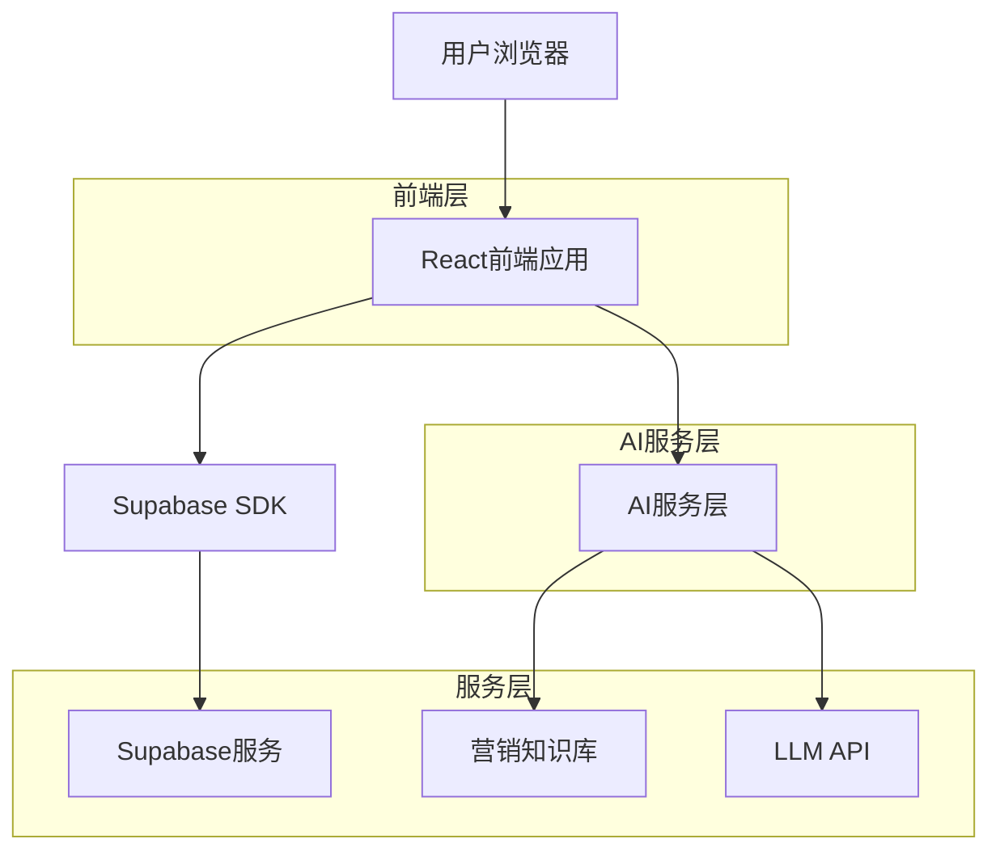
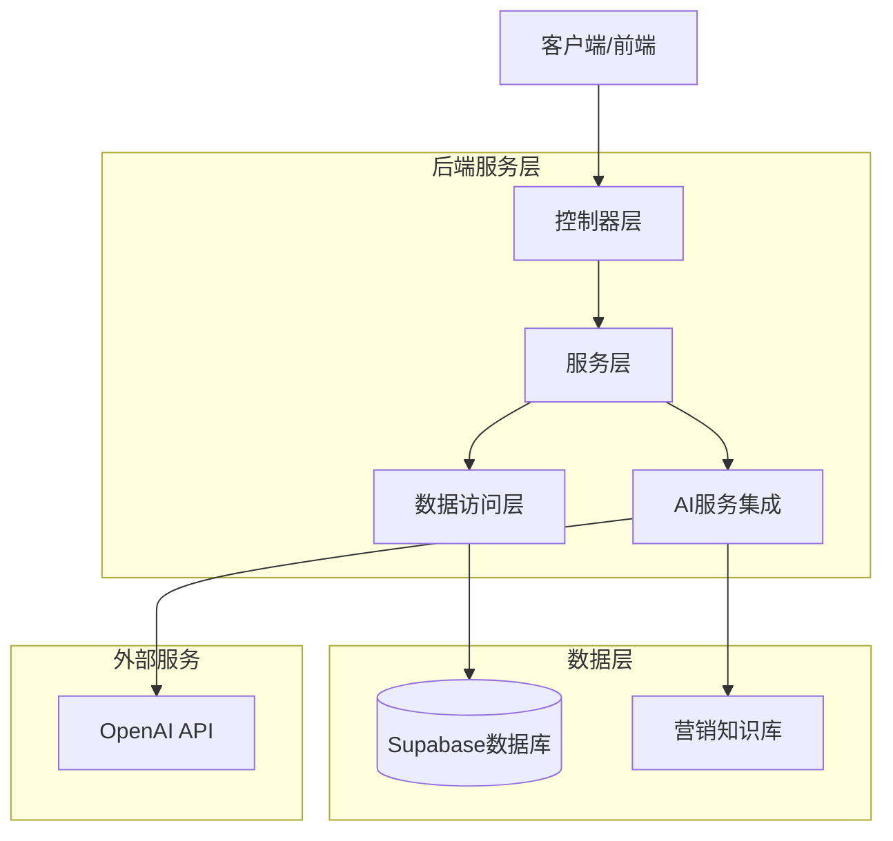
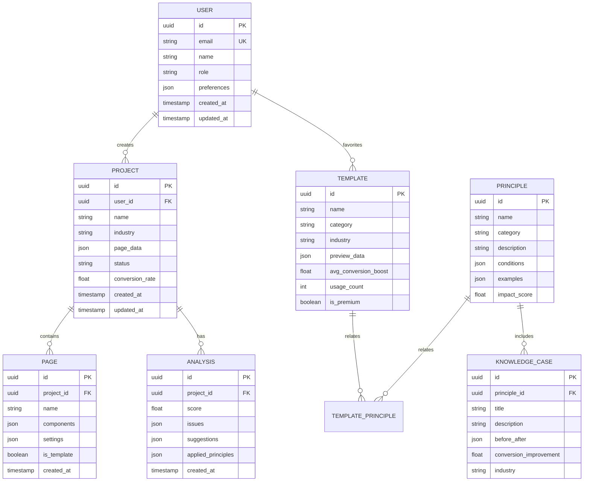

## 1. 架构设计



## 2. 技术描述
- 前端: React@18 + TypeScript@5 + TailwindCSS@3 + Vite
- 初始化工具: vite-init
- 后端: Supabase (认证 + 数据库 + 存储)
- AI服务: 自建Node.js服务，集成OpenAI API和营销知识库
- 状态管理: Zustand
- UI组件库: Ant Design@5 + 自定义组件
- 拖拽编辑器: react-dnd + react-beautiful-dnd

## 3. 路由定义
| 路由 | 用途 |
|-------|---------|
| / | 首页，展示产品价值和模板推荐 |
| /editor/:id | 编辑器页面，核心设计工作区 |
| /templates | 模板库，展示各类高转化率模板 |
| /knowledge | 知识库，营销设计原则和案例 |
| /dashboard | 用户中心，项目管理和数据分析 |
| /login | 登录页面 |
| /register | 注册页面 |
| /pricing | 价格方案页面 |

## 4. API定义

### 4.1 核心API

#### 智能诊断分析
```
POST /api/analyze-conversion
```

请求:
| 参数名 | 参数类型 | 是否必需 | 描述 |
|-----------|-------------|-------------|-------------|
| page_data | object | true | 页面结构和内容数据 |
| industry | string | true | 行业类型 |
| target_audience | string | false | 目标受众描述 |

响应:
| 参数名 | 参数类型 | 描述 |
|-----------|-------------|-------------|
| score | number | 转化率评分 (0-100) |
| issues | array | 问题列表，包含严重程度和描述 |
| suggestions | array | 优化建议列表 |
| principles | array | 相关的设计原则 |

#### AI营销文案生成
```
POST /api/generate-marketing-copy
```

请求:
| 参数名 | 参数类型 | 是否必需 | 描述 |
|-----------|-------------|-------------|-------------|
| product_info | object | true | 产品信息 |
| copy_type | string | true | 文案类型 (标题/卖点/描述/CTA) |
| style | string | false | 风格 (紧迫感/信任感/稀缺感) |
| psychology | string | false | 心理学原理 (社会认同/稀缺性/权威性等) |

#### 知识库查询
```
GET /api/knowledge/principles
```

查询参数:
| 参数名 | 参数类型 | 是否必需 | 描述 |
|-----------|-------------|-------------|-------------|
| category | string | false | 原则分类 (cta/trust/urgency/visual) |
| industry | string | false | 行业筛选 |
| search | string | false | 搜索关键词 |

## 5. 服务器架构图



## 6. 数据模型

### 6.1 数据模型定义


### 6.2 数据定义语言

#### 用户表 (users)
```sql
-- 创建用户表
CREATE TABLE users (
    id UUID PRIMARY KEY DEFAULT gen_random_uuid(),
    email VARCHAR(255) UNIQUE NOT NULL,
    name VARCHAR(100) NOT NULL,
    role VARCHAR(20) DEFAULT 'user' CHECK (role IN ('user', 'premium', 'enterprise')),
    preferences JSONB DEFAULT '{}',
    created_at TIMESTAMP WITH TIME ZONE DEFAULT NOW(),
    updated_at TIMESTAMP WITH TIME ZONE DEFAULT NOW()
);

-- 创建索引
CREATE INDEX idx_users_email ON users(email);
CREATE INDEX idx_users_role ON users(role);
```

#### 项目表 (projects)
```sql
-- 创建项目表
CREATE TABLE projects (
    id UUID PRIMARY KEY DEFAULT gen_random_uuid(),
    user_id UUID NOT NULL REFERENCES users(id) ON DELETE CASCADE,
    name VARCHAR(255) NOT NULL,
    industry VARCHAR(50) NOT NULL,
    page_data JSONB DEFAULT '{}',
    status VARCHAR(20) DEFAULT 'draft' CHECK (status IN ('draft', 'published', 'archived')),
    conversion_rate FLOAT DEFAULT 0,
    created_at TIMESTAMP WITH TIME ZONE DEFAULT NOW(),
    updated_at TIMESTAMP WITH TIME ZONE DEFAULT NOW()
);

-- 创建索引
CREATE INDEX idx_projects_user_id ON projects(user_id);
CREATE INDEX idx_projects_industry ON projects(industry);
CREATE INDEX idx_projects_status ON projects(status);
```

#### 设计原则表 (principles)
```sql
-- 创建设计原则表
CREATE TABLE principles (
    id UUID PRIMARY KEY DEFAULT gen_random_uuid(),
    name VARCHAR(255) NOT NULL,
    category VARCHAR(50) NOT NULL CHECK (category IN ('cta', 'trust', 'urgency', 'visual', 'copywriting')),
    description TEXT NOT NULL,
    conditions JSONB DEFAULT '{}',
    examples JSONB DEFAULT '[]',
    impact_score FLOAT DEFAULT 0 CHECK (impact_score >= 0 AND impact_score <= 100),
    created_at TIMESTAMP WITH TIME ZONE DEFAULT NOW()
);

-- 创建索引
CREATE INDEX idx_principles_category ON principles(category);
CREATE INDEX idx_principles_impact_score ON principles(impact_score DESC);
```

#### 知识库案例表 (knowledge_cases)
```sql
-- 创建知识库案例表
CREATE TABLE knowledge_cases (
    id UUID PRIMARY KEY DEFAULT gen_random_uuid(),
    principle_id UUID NOT NULL REFERENCES principles(id) ON DELETE CASCADE,
    title VARCHAR(255) NOT NULL,
    description TEXT NOT NULL,
    before_after JSONB DEFAULT '{}',
    conversion_improvement FLOAT DEFAULT 0,
    industry VARCHAR(50),
    created_at TIMESTAMP WITH TIME ZONE DEFAULT NOW()
);

-- 创建索引
CREATE INDEX idx_knowledge_cases_principle_id ON knowledge_cases(principle_id);
CREATE INDEX idx_knowledge_cases_industry ON knowledge_cases(industry);
```

#### 设置权限
```sql
-- 授予匿名用户基本读取权限
GRANT SELECT ON principles TO anon;
GRANT SELECT ON knowledge_cases TO anon;
GRANT SELECT ON templates TO anon;

-- 授予认证用户完整权限
GRANT ALL PRIVILEGES ON users TO authenticated;
GRANT ALL PRIVILEGES ON projects TO authenticated;
GRANT ALL PRIVILEGES ON pages TO authenticated;
GRANT ALL PRIVILEGES ON analyses TO authenticated;

-- 设置行级安全策略
ALTER TABLE projects ENABLE ROW LEVEL SECURITY;
CREATE POLICY "用户只能访问自己的项目" ON projects
    FOR ALL TO authenticated
    USING (auth.uid() = user_id)
    WITH CHECK (auth.uid() = user_id);
```

#### 初始化数据
```sql
-- 插入核心设计原则
INSERT INTO principles (name, category, description, conditions, examples, impact_score) VALUES
('头图三要素', 'visual', '主图必须包含产品、卖点、场景三个要素', '{"required_elements": ["product", "benefit", "scenario"]}', '["展示产品在真实使用场景中，突出核心卖点"]', 85),
('FAB法则', 'copywriting', '特征-优势-利益的递进式文案结构', '{"structure": ["feature", "advantage", "benefit"]}', '["先说明产品特征，再强调优势，最后突出用户利益"]', 78),
('社会认同', 'trust', '利用用户评价、销量数据建立信任', '{"elements": ["reviews", "ratings", "sales_numbers"]}', '["展示真实用户评价，突出销量和好评率"]', 92),
('稀缺性原理', 'urgency', '通过限时限量营造紧迫感', '{"tactics": ["time_limit", "quantity_limit", "exclusive"]}', '["限时优惠、限量发售、独家专享等策略"]', 88),
('明确CTA', 'cta', '行动召唤按钮必须清晰明确', '{"requirements": ["clear_text", "prominent_color", "single_focus"]}', '["使用"立即购买"、"马上抢购"等明确动词"]', 95);

-- 插入典型案例
INSERT INTO knowledge_cases (principle_id, title, description, before_after, conversion_improvement, industry) VALUES
((SELECT id FROM principles WHERE name = '头图三要素'), '服装类目转化率提升35%', '通过优化主图展示穿搭效果和场景，转化率从2.1%提升至2.8%', '{"before": "单纯产品展示", "after": "模特穿搭+场景展示"}', 35, 'fashion'),
((SELECT id FROM principles WHERE name = '社会认同'), '电子产品信任建立案例', '添加用户评价和销量展示后，转化率提升42%', '{"before": "无用户评价", "after": "展示4.8分评价和10万+销量"}', 42, 'electronics');
```